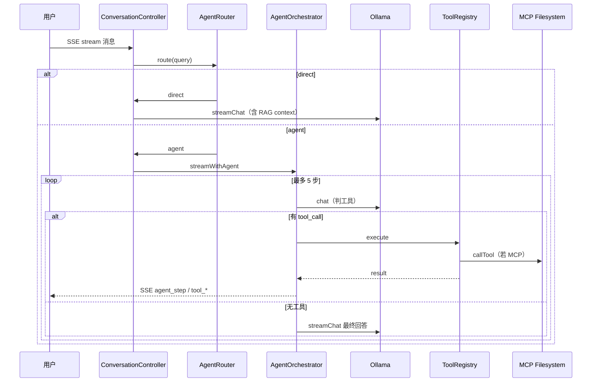

# Agent 能力集成设计规格

**日期：** 2026-06-25  
**状态：** 已批准  
**范围：** study-nest-js（后端 Agent / MCP）+ admin-web（聊天 Agent 时间线）  
**对齐：** `AI学习扩展.md` 第二阶段（Agent / MCP / LangGraph 学习路线）

---

## 1. 背景与目标

当前聊天链路已具备：

- SSE 流式 + Ollama 本地模型
- **单轮** Function Calling（`ToolOrchestrator`：判工具 → 执行 → 流式回答）
- 内置工具 `getWeather`
- RAG 知识库（stream 前检索注入 ContextBuilder，非 Agent 工具）
- 前端 `tool_call` / `tool_result` / `rag_retrieval` SSE 事件

**缺口：**

- 多步 ReAct 推理循环
- 知识库作为 Agent 可调用工具
- MCP 接入外部能力
- 简单问答与复杂任务的智能路由

**目标：** 第一期均衡交付完整 Agent 栈骨架：

```
用户消息
  ↓
AgentRouter（直答 vs Agent）
  ↓
AgentOrchestrator（ReAct，最多 5 步）
  ↓
ToolRegistry（内置 + MCP）
  ├─ getWeather
  ├─ searchKnowledgeBase
  └─ MCP filesystem（read_file / list_directory …）
  ↓
最终流式回答 + SSE 步骤时间线
```

**本期做：**

- `AgentRouterService` 智能路由（规则 + 轻量 LLM 路由）
- `AgentOrchestratorService` 多步 ReAct（替代单轮 `ToolOrchestrator` 作为主路径）
- `searchKnowledgeBase` 内置工具（复用 `RetrievalService`）
- `McpClientService` + filesystem MCP Server（stdio）
- SSE 扩展：`agent_start` / `agent_step` / 现有 `tool_call` / `tool_result` / `agent_done`
- 聊天页 Agent 执行时间线 UI

**本期不做：**

- LangGraph 工作流编排（第二期）
- Ollama 原生 `tool_calls` API（继续 Prompt JSON 解析）
- MCP MySQL / HTTP 等企业连接器（第二期）
- Agent 步骤 / 工具调用持久化到数据库
- 文档级 MCP 写操作（filesystem 只读）

---

## 2. 方案选型

| 维度 | 选择 | 理由 |
|------|------|------|
| 编排 | NestJS 原生 ReAct 循环（方案 A） | 复用现有 `ToolRegistry` / `ToolCallParser`，改动可控 |
| MCP | `@modelcontextprotocol/sdk` stdio Client | 官方 SDK，filesystem 示范成熟 |
| LLM | Ollama + Prompt JSON | 与现网一致，无新依赖 |
| 路由 | 规则快判 + 小 prompt 路由 | 满足「智能切换」，避免每条消息跑满 Agent |
| RAG | 工具化 + 保留勾选预检索 | 勾选时仍可预注入；Agent 模式可主动 `searchKnowledgeBase` |

**不选 LangGraph（第一期）：** 集成成本高，与 Nest 生命周期耦合重；第二期再引入。

---

## 3. 架构

### 3.1 模块划分

```
src/ai/agent/
  agent.constants.ts
  agent-router.service.ts
  agent-orchestrator.service.ts
  agent-context.type.ts

src/ai/mcp/
  mcp-client.service.ts
  mcp-tool-bridge.service.ts

src/ai/tools/implementations/
  knowledge-base-search.tool.ts
```

- `AgentRouterService`：输出 `direct` | `agent`
- `AgentOrchestratorService`：ReAct 主循环，依赖 `AiService`、`ToolRegistry`、`ToolPromptService`、`ToolCallParserService`
- `McpClientService`：子进程拉起 filesystem MCP，暴露 `listTools()` / `callTool()`
- `McpToolBridgeService`：将 MCP tools 注册进 `ToolRegistry`（前缀 `mcp_`）

### 3.2 数据流



---

## 4. Agent ReAct 循环

### 4.1 常量

```typescript
export const MAX_AGENT_STEPS = 5;
export const AGENT_ROUTER_MODEL_FALLBACK = 'direct'; // 路由失败时
```

### 4.2 循环逻辑

1. 发送 `agent_start` SSE
2. `step = 1 .. MAX_AGENT_STEPS`：
   - 组装 messages：`system(toolPrompt)` + 历史 + 累积 tool 观察
   - 非流式 `aiService.chat(..., { skipCache: true })`
   - `parser.parse()` → 无工具：**进入最终 `streamChat`**，发 `agent_done`，结束
   - 有工具：发 `agent_step` + `tool_call` → 执行 → 发 `tool_result` → 将观察写入 messages，继续
3. 若达到 `MAX_AGENT_STEPS` 仍有工具意图：强制最终 `streamChat`（附「已达最大步数」system 提示）

### 4.3 与现有 ToolOrchestrator 关系

- `ToolOrchestratorService` 保留，标记 `@deprecated`，内部可委托 `AgentOrchestrator` 单步逻辑
- `ConversationController` 改注入 `AgentOrchestratorService`

---

## 5. 智能路由（auto_detect）

### 5.1 规则快判（direct）

满足任一即 `direct`：

- 消息 trim 后长度 ≤ 12 且匹配：`/^(你好|hi|hello|在吗|谢谢|好的|嗯|哦)[!?？。~]*$/i`
- 无工具关键词、无文件路径、无「查/分析/对比/总结/读取」等动词

### 5.2 LLM 路由

其余消息发一次非流式路由 prompt：

```
判断用户消息是否需要多步工具推理。
仅输出 JSON：{"mode":"direct"} 或 {"mode":"agent"}
agent 示例：查天气、读文件、查知识库、多步分析
direct 示例：闲聊、简单概念解释
```

解析失败 → `agent`（偏能力展示，与用户选择一致）

### 5.3 direct 路径

- 使用现有 `contextBuilder.build()`（含 RAG 预检索）
- `aiService.streamChat()`，**不走** ReAct

---

## 6. 工具层

### 6.1 searchKnowledgeBase

```typescript
name: 'searchKnowledgeBase'
parameters:
  - query (string, required)
description: 从用户已选知识库中检索相关片段
```

- 执行时从 `AgentContext` 读取 `knowledgeBaseIds`、`userId`、`role`
- 内部调用 `RetrievalService.search(query, knowledgeBaseIds, user)`
- 返回 JSON 字符串：`{ citations: [...], chunks: [{ documentName, content, score }] }`
- 未选知识库时返回：`未选择知识库，请让用户在聊天页勾选知识库`

### 6.2 MCP filesystem

**Server 启动：**

```bash
npx -y @modelcontextprotocol/server-filesystem <root1> <root2>
```

**环境变量（`.env.dev`）：**

```
MCP_FILESYSTEM_ENABLED=true
MCP_FILESYSTEM_ROOTS=./docs,./uploads/kb
```

**安全：**

- 仅配置只读根目录
- Nest 启动时校验路径存在且在 `process.cwd()` 下
- MCP 工具映射为 `mcp_read_file`、`mcp_list_directory`（避免与内置冲突）

### 6.3 工具注册顺序

`onModuleInit`：

1. `getWeather`
2. `searchKnowledgeBase`（需 `RetrievalService`，通过 factory 注入）
3. MCP tools（若 enabled）

---

## 7. SSE 协议

### 7.1 新增 phase

| phase | 字段 | 说明 |
|-------|------|------|
| `agent_start` | `maxSteps` | Agent 开始 |
| `agent_step` | `step`, `maxSteps` | 进入第 N 步推理 |
| `tool_call` | `tool`, `args`, `step?` | 已有，增加 step |
| `tool_result` | `tool`, `result`, `error?`, `step?` | 已有 |
| `agent_done` | `steps` | Agent 结束 |
| `rag_retrieval` | `citations` | 保留（direct 路径预检索） |

### 7.2 direct 路径

不发送 `agent_*` 事件；保留 `rag_retrieval`（若勾选知识库）。

---

## 8. 前端（admin-web）

### 8.1 服务层

`services/ai.ts` 扩展 SSE 解析：

- `onAgentStart` / `onAgentStep` / `onAgentDone`
- `phase` 类型联合扩展

### 8.2 状态

`useChatMessages` 增加：

```typescript
agentSteps?: Array<{
  step: number;
  type: 'thinking' | 'tool_call' | 'tool_result';
  tool?: string;
  args?: Record<string, string>;
  result?: string;
  error?: string;
}>;
```

### 8.3 UI

- 新建 `components/chat/AgentStepBlock.tsx`（可折叠时间线）
- `ChatMessageItem` 在 `toolCalls` 旁展示 `agentSteps`
- 路由模式不展示 UI 开关（自动检测，对用户透明）

---

## 9. 配置与依赖

### 9.1 npm 依赖

```bash
pnpm add @modelcontextprotocol/sdk
```

filesystem server 通过 `npx` 运行时拉取，不写入 dependencies。

### 9.2 模块依赖

```
AiModule imports KnowledgeBaseModule（仅 RetrievalService 用于 KB 工具）
ConversationModule 不变（仍经 AiModule）
```

---

## 10. 错误处理

| 场景 | 行为 |
|------|------|
| MCP Server 启动失败 | 日志 warn，跳过 MCP 工具，Agent 仍可用内置工具 |
| 工具执行失败 | `tool_result` 带 `error`，Agent 继续下一步 |
| 达到 MAX_AGENT_STEPS | 强制总结流式输出 |
| Ollama 超时 | 现有 SSE error 事件 |
| KB 未勾选却调 searchKnowledgeBase | 工具返回提示文本，模型引导用户勾选 |

---

## 11. 测试策略

| 层级 | 内容 |
|------|------|
| 单元 | `AgentRouterService` 规则路由；`AgentOrchestrator` mock AiService 多步循环；`knowledge-base-search.tool` |
| 单元 | `McpToolBridge` mock client |
| 集成 | 可选 e2e：mock Ollama 返回 tool JSON |

**验收用例（手工）：**

1. 「你好」→ direct，无 agent 事件
2. 「武汉天气」→ agent，`getWeather` + 回答
3. 勾选知识库 + 「年假多少天」→ `searchKnowledgeBase` + 引用
4. 「读 docs 里 agent 设计文档并总结」→ `mcp_read_file` + 总结
5. SSE 时间线可见步骤

---

## 12. 第二期预留

- LangGraph.js 编排复杂 SOP
- MCP MySQL / 自定义 HTTP
- Ollama native tool_calls
- Agent 步骤落库、可回放
- 聊天页「强制 Agent 模式」开关（可选）

---

## 13. 文件清单（预期变更）

**后端新建：**

- `src/ai/agent/agent.constants.ts`
- `src/ai/agent/agent-context.type.ts`
- `src/ai/agent/agent-router.service.ts`
- `src/ai/agent/agent-router.service.spec.ts`
- `src/ai/agent/agent-orchestrator.service.ts`
- `src/ai/agent/agent-orchestrator.service.spec.ts`
- `src/ai/mcp/mcp-client.service.ts`
- `src/ai/mcp/mcp-tool-bridge.service.ts`
- `src/ai/tools/implementations/knowledge-base-search.tool.ts`

**后端修改：**

- `src/ai/ai.module.ts`
- `src/ai/tools/tool-registry.service.ts`
- `src/conversation/conversation.controller.ts`

**前端修改：**

- `services/ai.ts`
- `hooks/useChatMessages.ts`
- `components/chat/AgentStepBlock.tsx`（新建）
- `components/chat/ChatMessageItem.tsx`

**配置：**

- `study-nest-js/.env.dev` 增加 MCP 变量
- `study-nest-js/SETUP.md` 补充 MCP 说明
