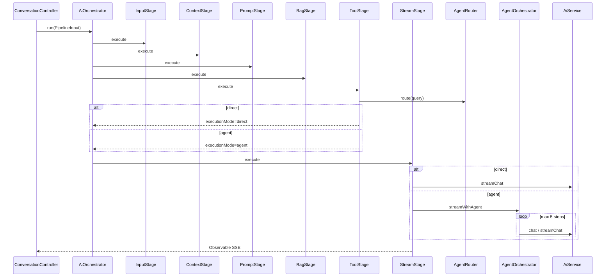

# AI Orchestrator 统一调度器设计规格

**日期：** 2026-06-26  
**状态：** 待批准  
**范围：** `study-nest-js`（后端统一编排）+ `admin-web`（Agent 时间线接线）  
**前置规格：** `2026-06-25-agent-integration-design.md`、`context-engine` 已实现能力  
**用户选择：** **完整 Agent 栈（C）** — Orchestrator + Stage 拆分 + AgentRouter + MCP + 多步 ReAct

---

## 1. 背景与目标

### 1.1 现状问题

当前聊天流是 **四段拼接**，无统一调度器：

| 阶段 | 当前落点 | 问题 |
|------|----------|------|
| Input | `ConversationController.stream()` + `prepareStream()` | 校验、写库、regenerate、摘要、标题与编排混在一起 |
| Context | `ContextEngineService.buildPlan()` | 与 Prompt/RAG 耦合在同一方法内 |
| Prompt | Controller `formatUserMessage()` + ContextEngine `buildSystemPrompt()` | 双轨，无单一 Prompt Engine |
| RAG | `createRagBlocks()` 内嵌于 ContextEngine | 另有 `searchKnowledgeBase` 工具未注册，双轨 |
| Tool | `ToolOrchestratorService.streamWithTools()` | 单轮；`AgentOrchestrator` / `AgentRouter` / MCP **已写未接入** |
| Stream | `ConversationStreamService` | 职责清晰，但与上游无统一契约 |

**企业级后果：**

- 逻辑散，难以审计与测试
- 无法控制执行顺序（例如在 RAG 前/后插新 Stage）
- Agent 无法扩展（MCP、多步 ReAct 停在半成品）

### 1.2 目标架构

建立 **单一入口** `AiOrchestratorService`，按固定 Pipeline 调度各 Engine：

```
Input
  → Context Engine
  → Prompt Engine
  → RAG Engine
  → Tool Engine（Router → Direct / Tool / Agent）
  → Stream Output
```

**本期交付：**

1. `AiOrchestratorService` 作为聊天 SSE **唯一编排入口**
2. 六个 Stage 接口化，可单测、可扩展
3. **完整 Agent 栈接入主链路**：`AgentRouter` + `AgentOrchestrator` + `searchKnowledgeBase` + MCP filesystem
4. RAG **双轨收敛**：预检索（RAG Stage）+ Agent 工具化检索统一配置
5. 删除/废弃 `ContextBuilderService` 死代码；`ToolOrchestrator` 标记 deprecated 并委托 Agent 路径
6. 前端 Agent 时间线（`AgentStepBlock`）接线 SSE 事件

**本期不做：**

- LangGraph 工作流
- Ollama 原生 `tool_calls` API（继续 Prompt JSON 解析）
- Agent 步骤持久化到 DB
- MCP 写操作 / 多 MCP Server 热插拔

---

## 2. 方案选型

| 方案 | 描述 | 结论 |
|------|------|------|
| A | 新建 `AiOrchestratorService` + Stage 接口 | **采用** |
| B | 强化 ContextEngine 为总编排器 | 拒绝 — 易成上帝模块 |
| C | Pipeline 中间件链 | 拒绝 — 过度抽象 |

---

## 3. 模块结构

```
study-nest-js/src/ai/orchestrator/
  ai-orchestrator.module.ts
  ai-orchestrator.service.ts          # 唯一编排入口 run()
  types/
    pipeline-input.type.ts
    pipeline-context.type.ts
    pipeline-result.type.ts
    pipeline-stage.type.ts
  stages/
    input.stage.ts
    context.stage.ts
    prompt.stage.ts
    rag.stage.ts
    tool.stage.ts
    stream.stage.ts
```

**依赖关系：**

```
AiOrchestratorModule
  imports: ContextEngineModule, KnowledgeBaseModule, ConversationModule(forwardRef)
  providers: AiOrchestratorService + 6 Stages
  exports: AiOrchestratorService

ConversationController
  仅保留: 鉴权、SSE 装饰器、resumeStream
  新消息 → aiOrchestrator.run(input) → Observable<MessageEvent>
```

**AiModule 扩展（注册已有半成品）：**

```typescript
providers: [
  // 现有 ...
  AgentRouterService,
  AgentOrchestratorService,
  McpClientService,
  McpToolBridgeService,
  // knowledge-base-search 在 ToolRegistry onModuleInit 注册
]
```

---

## 4. Pipeline 数据契约

### 4.1 PipelineInput（Controller → Orchestrator）

```typescript
interface PipelineInput {
  conversationId: number;
  userId: number;
  role: string;
  content: string;
  promptId?: string;
  knowledgeBaseIds?: number[];
  isRegenerate?: boolean;
  resumeStreamId?: string;  // 续传时仅走 Stream Stage
}
```

### 4.2 PipelineContext（Stage 间传递，可变）

```typescript
interface PipelineContext {
  // Input Stage 产出
  sanitizedContent: string;
  messageContent: string;       // 落库用（含 prompt 格式化）
  userMessageId?: number;

  // Context Stage 产出
  conversation: Conversation;
  messages: Message[];
  summary: string | null;

  // Prompt Stage 产出
  promptTemplateId?: string;
  usePrompt: boolean;

  // RAG Stage 产出
  ragChunks: RagChunk[];
  ragCitations: RagCitation[];

  // Context + Prompt + RAG 合并后
  contextPlan: ContextPlan;
  ollamaMessages: ChatMessage[];

  // Tool Stage 产出
  routeMode: 'direct' | 'agent';
  agentContext: AgentContext;

  // Stream Stage 产出
  streamId: string;
  isFirstAiReply: boolean;
}
```

### 4.3 Stage 接口

```typescript
interface PipelineStage {
  readonly name: string;
  execute(ctx: PipelineContext, input: PipelineInput): Promise<void>;
}
```

每个 Stage **只读写 `PipelineContext` 中自己负责的字段**，通过 Orchestrator 顺序调用，禁止 Stage 间直接互调。

---

## 5. 各 Stage 职责

### 5.1 Input Stage

**职责：** 输入校验与消息持久化前置逻辑（从 `prepareStream` 下沉）

| 步骤 | 实现 |
|------|------|
| 会话校验 | `ConversationService.findOneOrFail` + `assertMessageLimit` |
| Prompt 注入检测 | `promptId` 是否存在 |
| Regenerate | 删 assistant / 更新 user 内容（现有逻辑搬迁） |
| 新建 user 消息 | `createUserMessage`；首条绑定 prompt + `updateTitleDirect` |
| 安全校验 | `PromptGuardService.validateUserInput` + `getKnownToolNames` |
| 摘要触发 | 消息数超阈值 → `SummaryService.generateInitialSummary` |

**产出：** `sanitizedContent`, `messageContent`, `conversation`, `messages`, `summary`

### 5.2 Context Stage

**职责：** 组装上下文块规划（**不含** Prompt 模板正文、**不含** RAG 检索）

从 `ContextEngineService.buildPlan()` 拆分：

- 保留：`isolation`、`summary`、`memory`、`message blocks`、`current user`、`pruning`、`token budget`、`trace`
- **移除：** `createPromptBlock()`、`createRagBlocks()` → 交给后续 Stage

新增 `ContextEngineService.buildBasePlan()` 或在 `buildPlan` 增加 `skipPrompt` / `skipRag` 选项（推荐选项 flags，避免双方法漂移）。

### 5.3 Prompt Stage

**职责：** 统一 Prompt 格式化出口

| 场景 | 行为 |
|------|------|
| 首条 + `promptId` | `formatUserMessage` + `bindPromptTemplate` |
| 任意轮 + 已绑定模板 | `buildSystemPrompt` → 注入 `ContextPlan` 的 `prompt` block |
| 无模板 | 仅 isolation system（由 Context Stage 已加） |

**新建：** `PromptEngineService`（薄封装 `PromptTemplateService` + `PromptGuardService.wrapForModel`）

**删除重复：** `ContextBuilderService.resolvePromptContext()`、`ContextEngine` 内 prompt 块创建逻辑迁至本 Stage。

### 5.4 RAG Stage

**职责：** 知识库预检索（用户勾选 `knowledgeBaseIds` 时）

```typescript
// RagEngineService.retrieve()
if (!knowledgeBaseIds?.length) return { chunks: [], citations: [] };
const chunks = await retrievalService.search(query, knowledgeBaseIds, currentUser);
return { chunks, citations: retrievalService.toCitations(chunks) };
```

将 `RagChunk[]` 转为 `ContextBlock[]` 追加到 `contextPlan`，再 `ContextComposerService.compose()`。

**SSE：** 若有命中，Stream Stage 首帧可发 `phase: 'rag_retrieval'`（与前端 `CitationBlock` 对齐）。

**与 Agent 工具关系：**

- 勾选知识库 → RAG Stage **预注入**（低延迟简单问答）
- Agent 模式 → 仍可调用 `searchKnowledgeBase` 做**二次检索**（复杂多步）
- 两者共用 `RetrievalService`，不重复实现

### 5.5 Tool Stage

**职责：** 路由 + 选择执行器，**不**直接流式输出

```
AgentRouterService.route(sanitizedContent)
  → direct: executionMode = 'direct'
  → agent:  executionMode = 'agent'

构建 AgentContext { userId, role, knowledgeBaseIds }
ToolRegistry.setAgentContext(agentContext)
```

**执行器映射（写入 ctx，供 Stream Stage 消费）：**

| routeMode | 执行器 | 说明 |
|-----------|--------|------|
| `direct` | `DirectLlmExecutor` | `AiService.streamChat(ollamaMessages)` 单轮流式 |
| `agent` | `AgentOrchestratorService.streamWithAgent()` | 多步 ReAct，最多 5 步 |

**`ToolOrchestratorService`：** 标记 `@deprecated`，内部单轮逻辑由 `DirectLlmExecutor` 或 Agent 第一步吸收；`ConversationStreamService` **不再**直接依赖它。

**工具注册（`AiModule.onModuleInit`）：**

| 工具 | 状态 |
|------|------|
| `getWeather` | 已有 |
| `searchKnowledgeBase` | **本期注册** |
| `mcp_*` | MCP 启用时由 `McpToolBridgeService` 注册 |

**消除重复 system prompt：** Agent / Direct 路径**不再**在 `ToolPromptService.build()` 重复加 isolation（已由 Context + Prompt Stage 写入 `ollamaMessages`）。`AgentOrchestrator.buildToolMessages()` 仅追加 **工具说明** system，不重复 isolation。

### 5.6 Stream Stage

**职责：** 会话创建、后台生成、SSE 订阅（现有 `ConversationStreamService` 包装）

```
StreamSessionService.createSession(...)
ConversationStreamService.startDetachedGeneration({
  streamId,
  executionMode,      // 'direct' | 'agent'
  ollamaMessages,
  contextPlan,
  summary,
  agentContext,
})
return observeSession(streamId)
```

**`startDetachedGeneration` 改造：**

```typescript
// 按 executionMode 分支
if (mode === 'agent') {
  agentOrchestrator.streamWithAgent(ollamaMessages, summary, agentContext)
} else {
  aiService.streamChat(ollamaMessages, summary, { skipCache: true })
}
```

Finalize（moderation、落库、标题、摘要）仍在 `ConversationStreamService.finalizeGeneration()`。

---

## 6. 端到端时序



---

## 7. Agent 栈细节（完整接入）

### 7.1 AgentRouter

沿用 `AgentRouterService` 现有实现：

- 规则快判 → `direct`（短问候）
- 其余 → 轻量 LLM JSON 路由
- 失败默认 → `agent`（与 `AGENT_ROUTER_FALLBACK_MODE` 一致）

**扩展点（本期可选配置）：**

```env
AGENT_ROUTER_MODE=auto   # auto | direct | agent（调试用）
```

### 7.2 AgentOrchestrator

沿用 `AgentOrchestratorService.streamWithAgent()`，SSE phases：

| phase | 前端 |
|-------|------|
| `agent_start` | `AgentStepBlock` type=start |
| `agent_step` | type=step |
| `tool_call` | type=tool_call |
| `tool_result` | type=tool_result |
| `agent_done` | type=done |

### 7.3 MCP Filesystem

| 配置 | 说明 |
|------|------|
| `MCP_FILESYSTEM_ENABLED=true` | 启用 |
| `MCP_FILESYSTEM_ROOTS=../docs,../study-nest-js/src` | 只读根目录 |

`McpToolBridgeService` 注册时加前缀 `mcp_`（已有）。

### 7.4 searchKnowledgeBase

在 `ToolRegistryService.onModuleInit` 注册 `createKnowledgeBaseSearchTool(retrievalService, getAgentContext)`。

---

## 8. Controller 瘦身

**改造前：** `prepareStream()` ~150 行  
**改造后：**

```typescript
@Sse(':id/stream')
stream(...) {
  if (resumeStreamId) return this.aiOrchestrator.resume(conversationId, userId, resumeStreamId);
  return defer(() => from(this.aiOrchestrator.run({
    conversationId, userId, role: req.user.role,
    content: content!.trim(), promptId, knowledgeBaseIds, isRegenerate,
  }))).pipe(switchMap(obs => obs));
}
```

`ConversationController` 构造函数注入改为 `AiOrchestratorService`，移除对 `ContextEngine`、`ContextComposer`、`PromptTemplate`、`Summary`、`Title` 的直接依赖（全部下沉到 Stages）。

---

## 9. 前端变更（admin-web）

| 项 | 说明 |
|----|------|
| `StreamAdapter` | 解析 `agent_start` / `agent_step` / `agent_done`（若未实现则补齐） |
| `page.tsx` | 累积 `agentSteps` 到 assistant 消息 |
| `ChatMessageItem` | 渲染 `AgentStepBlock`（组件已有，需接 `AgentStepItem` 类型） |
| `globals.css` | `chat-agent-steps` 样式（若缺失则补） |

Direct 路径无 Agent 时间线；Agent 路径在 assistant 气泡顶部展示可折叠步骤。

---

## 10. 迁移计划

### Phase 1 — Orchestrator 壳 + Input/Stream 搬迁（可独立合并）

- [ ] 新建 `ai/orchestrator/` 模块与类型
- [ ] 实现 `InputStage`、`StreamStage`
- [ ] `AiOrchestratorService.run()` 串联；Controller 改调 orchestrator
- [ ] 行为与现网一致（仍走 `ToolOrchestrator` 作为临时执行器）
- [ ] 单测：`InputStage` regenerate / 首条 prompt

### Phase 2 — Context / Prompt / RAG Stage 拆分

- [ ] `ContextEngine.buildPlan({ skipPrompt, skipRag })`
- [ ] 新建 `PromptEngineService`、`RagEngineService`
- [ ] 删除 `conversation/context-builder.service.ts`
- [ ] 单测：RAG 预检索注入块顺序

### Phase 3 — 完整 Agent 栈

- [ ] `AiModule` 注册 Agent/MCP providers
- [ ] 注册 `searchKnowledgeBase`
- [ ] `ToolStage` + `AgentRouter`
- [ ] `StreamStage` 分支 `direct` / `agent`
- [ ] 去除 `ToolOrchestrator` 主路径依赖；重复 tool system prompt 清理
- [ ] 单测：`AgentRouter`、`AgentOrchestrator` 集成

### Phase 4 — 前端 Agent 时间线

- [ ] SSE 事件接线
- [ ] `ChatMessageItem` + `AgentStepBlock`
- [ ] E2E 手动：天气 / 知识库 / MCP 读文件

---

## 11. 测试策略

| 层级 | 覆盖 |
|------|------|
| Stage 单测 | 各 Stage mock 依赖，断言 `PipelineContext` 字段 |
| Orchestrator 集成测 | 完整 `run()` mock AI，断言 Stage 调用顺序 |
| Agent 单测 | 已有 `agent-router.service.spec.ts`、`agent-orchestrator.service.spec.ts` 保持 |
| 回归 | 流式续传、regenerate、多会话并行流式不受影响 |

---

## 12. 风险与缓解

| 风险 | 缓解 |
|------|------|
| Agent 路由误判 | 支持 `AGENT_ROUTER_MODE` 强制模式；路由 prompt 可迭代 |
| MCP 启动失败 | 已有 graceful degrade；工具列表不含 mcp_* |
| 双 RAG 冗余 | 预检索 topK=5；Agent 工具检索可设更小 topK |
| 重构范围大 | 四 Phase 分 PR，每 Phase 可独立验证 |

---

## 13. 成功标准

1. `ConversationController.prepareStream` 删除，编排逻辑仅在 `AiOrchestratorService`
2. Pipeline 顺序固定且可单测：Input → Context → Prompt → RAG → Tool → Stream
3. Agent 路径：多步工具 + MCP + searchKnowledgeBase 在生产 SSE 链路可用
4. Direct 路径：简单问答不走 ReAct，延迟不劣于现网
5. 前端 Agent 时间线可展示推理步骤

---

## 14. 与旧规格关系

- 本规格 **吸收并 supersede** `2026-06-25-agent-integration-design.md` 的「接入主链路」部分
- Context Engine P0/P1/P2 能力保留，仅调整 **调用边界**（由 Orchestrator 调度）
- 实现计划见后续 `docs/superpowers/plans/2026-06-26-ai-orchestrator.md`（待 `writing-plans` 生成）
